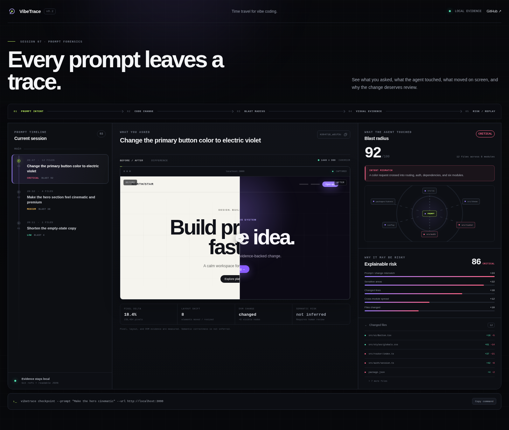

<p align="center">
  
</p>

<h1 align="center">VibeTrace</h1>

<p align="center"><strong>Time travel for vibe coding — with an authorization boundary.</strong></p>
<p align="center">See what you asked, what you allowed, and what the coding agent actually changed.</p>

<p align="center">
  <a href="https://github.com/feifeing/vibetrace/actions/workflows/ci.yml"></a>
  <a href="LICENSE"></a>
  
</p>



AI coding tools are very good at making changes. The harder problem is proving whether the resulting change stayed inside the boundary you intended to give them.

> “I asked for a button color. Why did the agent touch routing, auth, and twelve files?”

VibeTrace keeps three kinds of evidence separate:

```text
What you asked       → inferred intent
What you authorized  → explicit change contract
What happened        → Git + optional visual evidence
```

That distinction matters. A prompt is context. A declared change contract is permission. The resulting Git and visual state is evidence.

VibeTrace is local-first, agent-agnostic, Git-compatible, and deliberately explainable. It does not generate code, replace Git, or hide review decisions behind an opaque AI confidence score.

## The core contribution

Checkpoints, diffs, risk scoring, prompt history, path allowlists, visual regression, and blast-radius analysis all have prior art. VibeTrace does **not** claim those primitives as inventions.

Its current technical contribution is a narrower evidence model:

**Prompt Intent → Explicit Authorization → Observed Effect → Evidence Receipt → Verification**

This lets VibeTrace answer two different questions independently:

- **Intent mismatch:** did the observed change look broader than the prompt implied?
- **Authorization drift:** did the observed change cross a boundary the user explicitly declared?

Authorization drift is the stronger statement because it comes from a developer-declared rule, not natural-language inference.

A completed checkpoint can also produce a deterministic SHA-256 **Evidence Receipt** binding the prompt hash, declared contract, Git before/after objects, analysis, and available visual hashes. Later, `vibetrace verify` recomputes that receipt and re-hashes local visual artifacts when they exist.

The receipt is an integrity record. It is **not** an authorship signature, an identity proof, or a claim that the code is semantically correct.

## A practical workflow

Start a checkpoint before the coding agent edits:

```bash
vibetrace checkpoint \
  --prompt "Change the primary button color" \
  --allow "src/components/**,src/styles/**" \
  --deny "src/auth/**,src/router/**" \
  --max-files 3 \
  --max-lines 80
```

Let the agent work, inspect the live impact, then finish:

```bash
vibetrace diff
vibetrace checkpoint --finish
vibetrace report --open
```

If the agent actually changes:

```text
src/components/Button.tsx
src/styles/globals.css
src/auth/session.ts
src/router/index.ts
package.json
...
```

VibeTrace can preserve a result such as:

```text
Prompt intent        UI/styles · likely small
Declared contract    components/styles allowed
                     auth/router protected
                     ≤ 3 files · ≤ 80 changed lines
Observed effect      12 files · 6 modules
Intent mismatch      detected
Authorization drift  detected
Evidence receipt     vtr_…
```

No additional model is required to decide that `src/auth/**` violated an explicit `--deny` rule.

## Verify captured evidence

A receipt is only useful if it can be checked again later.

```bash
vibetrace verify
```

Verify a specific checkpoint or consume the result programmatically:

```bash
vibetrace verify vt_204718_a91f3c --json
```

Verification performs two independent checks:

1. **Receipt recomputation** — rebuilds the deterministic receipt from the currently stored checkpoint evidence.
2. **Visual artifact verification** — when before/after screenshots were captured, reads the actual local image files again and compares their SHA-256 hashes with the hashes recorded at capture time.

This means VibeTrace can distinguish:

```text
verified            stored evidence still matches

evidence-mismatch   checkpoint evidence changed after receipt creation
artifact-mismatch   a captured image exists but its bytes changed
artifact-missing    a captured image expected by the checkpoint is gone
```

`vibetrace verify` exits with status `0` when verification succeeds and `2` when the evidence does not match, so it can be used in scripts and CI.

### Trust model

VibeTrace currently provides **local integrity verification**, not a complete trust system.

It can detect accidental or uncoordinated modification of captured evidence. It cannot stop an attacker who controls the local repository from rewriting both the evidence and its receipt. Cryptographic signatures and external trust anchors are deliberately separate future work.

Verification also does **not** prove:

- who authored the code;
- which agent produced it;
- that the original machine or browser environment was trustworthy;
- that a screenshot is semantically correct;
- that a change is safe merely because its receipt verifies.

A verified receipt means something narrower and useful: **the evidence currently available to VibeTrace is internally consistent with the evidence that was bound into that receipt.**

## Why this is useful

### Review AI changes without guessing

Git diff answers **what changed**. VibeTrace adds **what was requested** and **what was explicitly permitted**.

### Put hard boundaries around soft prompts

Natural language is fuzzy. A change contract can turn “just tweak the hero” into auditable path constraints and file/line budgets.

### Preserve evidence without disturbing developer work

VibeTrace creates before/after snapshots with a temporary Git index and local Git objects. It does not move `HEAD`, stash the worktree, or replace the real index.

### See visual side effects next to code effects

With the optional Playwright adapter, checkpoints can capture before/after screenshots plus basic pixel, layout, and DOM evidence.

### Keep the reasoning inspectable

Blast Radius and risk are deterministic review heuristics. Every point maps to visible reasons such as file spread, sensitive areas, line churn, prompt mismatch, authorization drift, or unexpected visual movement.

## Try the interface

```bash
git clone https://github.com/feifeing/vibetrace.git
cd vibetrace
npm install
npm run dev
```

Open [http://127.0.0.1:4173](http://127.0.0.1:4173).

The demo presents the evidence chain as:

**Asked → Authorized → Observed → Evidence → Receipt**

## Install the repository CLI locally

```bash
npm link
cd /path/to/your-project
vibetrace init
```

A normal checkpoint does not require a contract:

```bash
vibetrace checkpoint --prompt "Make the hero cinematic"
```

A guarded checkpoint adds explicit authorization:

```bash
vibetrace checkpoint \
  --prompt "Make the hero cinematic" \
  --allow "src/marketing/**,src/styles/**" \
  --deny "src/auth/**,infra/**" \
  --max-files 5
```

The contract is stored with the recording checkpoint. `vibetrace checkpoint --finish` restores the same authorization context even when it runs later in another CLI process, evaluates the final change against it, and stores the resulting Evidence Receipt.

For an existing worktree change:

```bash
vibetrace checkpoint \
  --prompt "Describe the change that just happened" \
  --allow "src/ui/**" \
  --from-head
```

A clean worktree is rejected instead of generating a meaningless checkpoint.

## One-shot attestation

For scripts or an existing set of worktree changes:

```bash
vibetrace attest \
  --prompt "Change the button color" \
  --allow "src/components/**,src/styles/**" \
  --deny "src/auth/**" \
  --max-files 3 \
  --max-lines 80
```

`vibetrace attest` exits with status `2` when an explicit contract is violated. This makes it script-friendly without pretending to be an autonomous semantic policy engine.

## Optional visual evidence

Install Chromium once:

```bash
npx playwright install chromium
```

Keep the application running and start the checkpoint with a URL:

```bash
vibetrace checkpoint \
  --prompt "Refine the checkout summary" \
  --allow "src/checkout/**,src/styles/**" \
  --deny "src/auth/**" \
  --url http://localhost:3000

# agent edits; dev server reloads
vibetrace checkpoint --finish
vibetrace report --open
```

Each captured PNG is SHA-256 hashed at capture time and re-hashed by `vibetrace verify` when the local artifact is available.

| Evidence layer       | Capture | Verification | Meaning                                      |
| -------------------- | ------- | ------------ | -------------------------------------------- |
| Git object IDs       | Yes     | Receipt      | Before/after repository object references   |
| File + line scope    | Yes     | Receipt      | Normalized changed paths and churn           |
| Contract compliance  | Yes     | Receipt      | Explicit authorization drift                 |
| Screenshot bytes     | Yes     | **File hash**| Detect replaced or missing local PNGs        |
| Pixel difference     | Yes     | Receipt      | Thresholded RGBA difference                  |
| Layout change        | Basic   | Receipt      | Visible elements moved/resized/added/removed |
| DOM change           | Basic   | Receipt      | DOM fingerprint + visible-node delta         |
| Semantic correctness | **No**  | **No**       | Requires assertions or human review          |

Browser output can vary by OS, browser build, fonts, and hardware. Compare visual captures from the same environment.

## CLI

| Command                                 | What it does                                                    |
| --------------------------------------- | --------------------------------------------------------------- |
| `vibetrace init`                        | Initializes local VibeTrace state                               |
| `vibetrace checkpoint --prompt "…"`     | Starts a two-phase before/after checkpoint                      |
| `vibetrace checkpoint … --allow/--deny` | Starts a checkpoint with an explicit change contract            |
| `vibetrace checkpoint --finish`         | Captures after state, evaluates evidence, stores a receipt      |
| `vibetrace checkpoint --abort`          | Removes active checkpoint metadata/artifacts/private refs       |
| `vibetrace diff [id]`                   | Shows live or saved Blast Radius and review evidence            |
| `vibetrace diff --json`                 | Emits machine-readable analysis                                 |
| `vibetrace attest …`                    | Checks current worktree changes against a declared contract     |
| `vibetrace verify [id]`                 | Recomputes the receipt and verifies local visual artifact bytes |
| `vibetrace verify [id] --json`          | Emits machine-readable integrity verification                   |
| `vibetrace replay`                      | Replays the current session timeline                            |
| `vibetrace session new --name "…"`      | Starts a separate evidence timeline                             |
| `vibetrace report [id]`                 | Generates a standalone local report                             |

Change-contract options:

```text
--allow <glob,...>    paths the change may touch
--deny <glob,...>     protected paths the change must not touch
--max-files <n>       maximum changed-file budget
--max-lines <n>       maximum inserted + deleted line budget
```

## How checkpoints avoid mutating your work

For a worktree snapshot VibeTrace:

1. creates a temporary Git index outside the repository;
2. loads `HEAD` into that index;
3. stages the current worktree into the temporary index;
4. writes a Git tree and local commit object;
5. deletes the temporary index; and
6. anchors evidence beneath private refs such as:

```text
refs/vibetrace/checkpoints/<id>/before
refs/vibetrace/checkpoints/<id>/after
```

The real index, branch, and worktree are not rewritten by checkpoint capture.

## Explainable analysis

The deterministic model separates breadth from review priority:

```text
Blast Radius = observed scope
             + module/directory spread
             + sensitive surfaces
             + intent mismatch
             + authorization drift

Risk = file scope
     + line churn
     + sensitive-area weights
     + prompt/change mismatch
     + explicit authorization drift
     + large-refactor shape
     + unexpected visual movement
```

`Intent mismatch` is heuristic. `Authorization drift` is based on a user-declared contract. The stored report preserves that distinction.

## Architecture

| Module                  | Responsibility                                             |
| ----------------------- | ---------------------------------------------------------- |
| `src/git/`              | Non-mutating snapshots and normalized Git evidence         |
| `src/core/intent.mjs`   | Transparent prompt-scope inference                         |
| `src/core/contract.mjs` | Explicit change authorization and compliance               |
| `src/core/receipt.mjs`  | Deterministic evidence receipts and receipt recomputation  |
| `src/verify.mjs`        | Checkpoint and local visual-artifact integrity verification|
| `src/core/risk.mjs`     | Blast Radius, mismatch, authorization drift, risk          |
| `src/core/store.mjs`    | Atomic checkpoint/session persistence and evidence binding |
| `src/visual/`           | Optional screenshot, pixel, layout, DOM evidence           |
| `src/report/` + `web/`  | Standalone evidence report                                 |

## What is implemented now

- [x] Two-phase prompt-aware checkpoints
- [x] Explicit path + file/line-budget change contracts
- [x] Authorization Drift distinct from inferred Intent Mismatch
- [x] Contract persistence across checkpoint start/finish processes
- [x] Non-mutating Git before/after evidence
- [x] Deterministic Evidence Receipts on completed checkpoints
- [x] Receipt recomputation with `vibetrace verify`
- [x] Detection of modified checkpoint evidence
- [x] Re-hashing of local before/after screenshot files
- [x] Detection of replaced or missing visual artifacts
- [x] One-shot `attest` command for scripts
- [x] Explainable Blast Radius and risk factors
- [x] Sessions, replay, JSON output, standalone reports
- [x] Optional Playwright screenshot evidence
- [x] Basic pixel/layout/DOM comparison
- [x] Automated unit/CLI/browser CI

## Related work and originality boundary

VibeTrace intentionally documents prior art rather than hiding it. AI change monitoring, Git checkpointing, prompt tracking, path allowlists, blast-radius analysis, visual regression, and session timelines existed before this project.

The project therefore does **not** use “first ever” claims for those primitives.

The distinctive design being developed here is the combination and separation of:

1. **inferred intent** — useful context, but not permission;
2. **explicit authorization** — the developer's declared change boundary;
3. **observed effect** — Git and optional visual evidence;
4. **authorization drift** — evidence that the effect crossed that boundary;
5. **deterministic receipts** — a compact integrity record over captured evidence; and
6. **verification** — recomputation plus direct re-hashing of local visual artifacts.

See [Related work and differentiation boundary](docs/related-work.md) for explicit non-novelty claims and the project's current design boundary.

## Roadmap

- [ ] Verify continued availability of referenced Git evidence objects
- [ ] Richer contract assertions beyond path/file/line budgets
- [ ] Guarded restore with drift detection, dry-run, and explicit confirmation
- [ ] Signed attestations layered on deterministic receipts
- [ ] Vendor-neutral coding-agent hooks
- [ ] PR annotations and portable evidence bundles
- [ ] Deterministic masking for volatile visual regions
- [ ] Accessibility-tree evidence and user-authored assertions

## Philosophy

**Intent is context, not permission.** A natural-language guess must not silently become an authorization boundary.

**Declared boundaries outrank guesses.** Crossing an explicit protected path is stronger evidence than a heuristic mismatch.

**Evidence before verdicts.** Preserve what happened before summarizing how risky it looks.

**Verification should be inspectable.** A receipt that cannot be recomputed is just decoration.

**Explainable before intelligent.** Review tooling should show why it raised a flag.

**Git-compatible, not Git-shaped.** Add AI-change context without becoming another Git GUI.

## Contributing

Read [CONTRIBUTING.md](CONTRIBUTING.md). Focused issues and pull requests are especially welcome around contract semantics, diff edge cases, risk calibration, deterministic capture, and evidence verification.

Security reports belong in [SECURITY.md](SECURITY.md), not public issues.

## License

[MIT](LICENSE) © VibeTrace contributors
